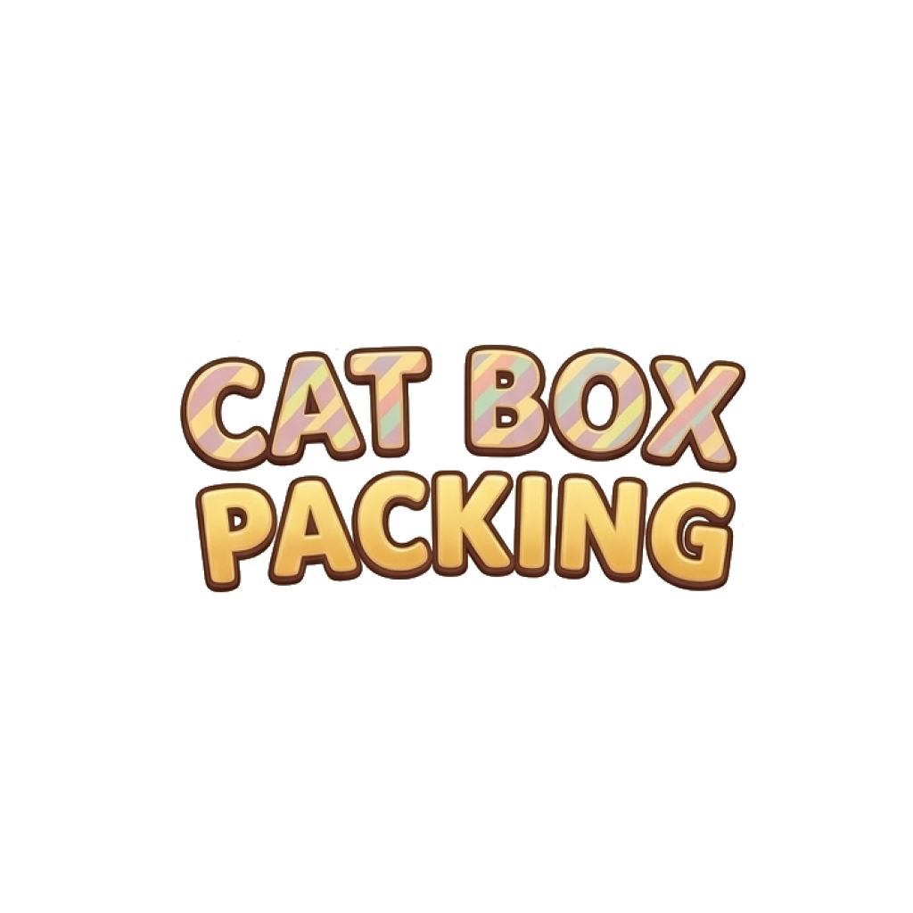

# Cat Box Packing 🐱📦

<p align="center">
  
</p>

A cozy puzzle game built with React Native and Expo where players fit various breeds of cats into snug cardboard boxes.

---

## 🛠️ Development Environment

Ensure your local development environment meets the following requirements before building or running the application:

* **Node.js**: `v18.x` or higher
* **Package Manager**: `npm` or `yarn`
* **Framework**: React Native with Expo SDK
* **TypeScript**: Configured with `react-jsx` support
* **iOS Development** (for local iOS builds/simulators):
  * macOS with **Xcode 15+** installed
  * CocoaPods (`sudo gem install cocoapods`)

---

## 🚀 Commands & Development Scripts

### Installation

Install the project dependencies:

```bash
npm install